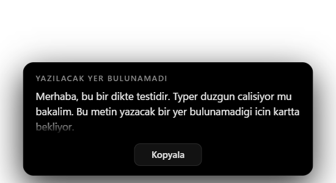

# Typer

Bir tuşa bas, konuş, tekrar bas. Söylediğin şey imlecin nerede ise oraya
yazılır — Slack'e, WhatsApp'a, bir terminale, bir tarayıcı formuna, fark
etmez.

Her şey **senin makinende** olur. Ses hiçbir yere gönderilmez, hesap
istemez, API anahtarı istemez, internet bağlantısı olmadan da çalışır
(modeli bir kez indirdikten sonra).

<p align="center">
  
</p>

Konuşurken ekranın altında küçük bir kapsül belirir. İçindeki çubuklar
rastgele oynamaz: mikrofonun gerçek frekans içeriğidir, bant bant. Tuşa
tekrar bastığın anda kapsül kapanır — çeviri arkada sürerken seni
bekletmez.

Yazacak bir yer bulunamazsa (masaüstündeysen mesela) kelimeler kaybolmaz;
bir kartta seni bekler:

<p align="center">
  
</p>

---

## Kurulum

Gereken iki şey: [uv](https://docs.astral.sh/uv/) ve
[Node.js](https://nodejs.org) 18+.

<details>
<summary><b>uv kurulu değilse</b></summary>

```bash
# macOS / Linux
curl -LsSf https://astral.sh/uv/install.sh | sh
```

```powershell
# Windows (PowerShell)
powershell -ExecutionPolicy ByPass -c "irm https://astral.sh/uv/install.ps1 | iex"
```
</details>

Sonra:

```bash
git clone https://github.com/taskiran/typer.git
cd typer
npm install
npm run setup
npm start
```

**NVIDIA ekran kartın varsa** `npm run setup` yerine `npm run setup:gpu`
de. Aradaki fark küçük değil: aynı cümle GPU'da `large-v3` ile 0.7
saniyede, CPU'da `small` ile birkaç saniyede çevrilir. GPU kütüphaneleri
bir gigabaytın üzerinde yer kapladığı için varsayılan kuruluma dahil
edilmedi.

İlk çalıştırmada konuşma modeli indirilir (`small` ~500 MB, `large-v3`
~1.5 GB). Bir kez.

Açıldıktan sonra Typer sistem tepsisinde/menü çubuğunda yaşar. Pencere
yok, konsol yok. Varsayılan olarak bilgisayarla birlikte başlar; tepsi
menüsünden kapatabilirsin.

### Önce bunu çalıştır

```bash
npm run doctor
```

Mikrofonu açar ve konuşmanı ister, sonra kısayola basmanı ister. İzin
sormakla yetinmez, gerçekten ölçer — çünkü mikrofon ve kısayol, işletim
sistemi tarafından **hata vermeden** engellenebilen iki şeydir. Bir
takıma dağıtırken "çalışmıyor" cümlesini hangi parçanın eksik olduğuna
çeviren tek araç budur.

---

## Kullanım

| | |
|---|---|
| **Ctrl + Win** (Windows) / **Ctrl + Command** (Mac) | başlat / bitir |
| Tepsi > Son metni kopyala | son çeviriyi panoya geri koy |
| Tepsi > Ayarları aç | `typer.json` |

Kısayol bir **anahtar/kilit**tir, basılı tutulmaz: bir bas konuş, bir bas
bitir. Arada tuş serbest olduğu için iki elin de klavyede kalır.

Mikrofon açıkken diğer uygulamalar susturulur, ki arkada çalan müzik ya
da video kaydın içine karışmasın. Spotify susturulmaz, **duraklatılır**:
susturulmuş müzik çalmaya devam eder ve bir dakikalık dikte şarkının bir
dakikasını yutar. Kayıt bitince kaldığı yerden devam eder — ve senin
kendi duraklattığın müzik asla kendiliğinden çalmaz.

---

## Ayarlar — `typer.json`

Kökte. İlk çalıştırmada `typer.example.json`'dan kopyalanarak oluşturulur
ve depoya girmez — kimsenin kendi kısayolu başkasının deposuna düşmesin
diye. Yalnızca değiştirmek istediğin anahtarı yaz; gerisi
varsayılanlardan gelir. Her anahtarın ne yaptığı
[`engine/typer_engine/config.py`](engine/typer_engine/config.py) içinde
tek tek yazılı.

```jsonc
{
  "hotkey": "ctrl+win",       // "win+6", "ctrl+alt+d", "f13", "home"...
  "mode": "toggle",           // ya da "hold" (basılı tut)
  "language": ["tr", "en"],   // "tr" sabitler, "" tam otomatik
  "model": "auto",            // auto | tiny | base | small | medium | large-v3
  "device": "auto",           // auto | cuda | cpu
  "sounds": true,             // açılış/kapanış blipleri
  "mute_others": true,        // mikrofon açıkken odayı sustur
  "pause_spotify": true,      // Spotify'ı susturmak yerine duraklat
  "max_seconds": 180,         // tek kayıt emniyet sınırı
  "start_at_login": true
}
```

**`language` neden liste?** Tespiti yalnızca bu ikisiyle sınırlar.
Gürültülü seste Whisper üçüncü bir dile savrulamaz, ama baştan sona
İngilizce bir cümle yine İngilizce çıkar. Cümle başına ~0.12 saniye.

**`model: "auto"`** donanıma göre açılır: CUDA varsa `large-v3`, yoksa
`small`.

---

## macOS

Çalışır, ama işletim sistemi üç ayrı izin ister ve **üçünü de sessizce
reddeder** — hata mesajı yok, sadece hiçbir şey olmaz. `npm run doctor`
hangisinin eksik olduğunu söyler.

| İzin | Ne için | Nerede |
|---|---|---|
| **Mikrofon** | ses kaydı | Gizlilik ve Güvenlik > Mikrofon |
| **Girdi İzleme** | kısayolu duymak | Gizlilik ve Güvenlik > Girdi İzleme |
| **Erişilebilirlik** | imlece yapıştırmak (Cmd+V) | Gizlilik ve Güvenlik > Erişilebilirlik |

Ek olarak, "yazacak yer var mı?" kontrolü ilk çalıştığında **System
Events** için bir otomasyon izni sorar. Reddedersen kart hiç çıkmaz;
yazma işi etkilenmez.

`npm start` ile geliştirme kipinde çalıştırırken bu izinler **Electron'a**
verilir, Typer'a değil. Paketlenmiş bir uygulama için ayrı verilmeleri
gerekir.

Mac'te ayrıca:

- **`ctrl+win` = Ctrl+Command.** Bu, macOS'ta Ctrl+Cmd+Q (ekranı kilitle)
  gibi sistem kısayollarının ön ekidir, yani onlara basarken Typer da
  ateşlenir. Mac'te **`"hotkey": "ctrl+alt+d"`** ya da **`"f13"`** daha
  rahat eder.
- **Model CPU'da çalışır.** CTranslate2'nin Metal arka ucu yoktur, yani
  Apple Silicon dahil. `"auto"` bu yüzden `small`'a düşer; `large-v3`
  CPU'da dikte için kullanılamayacak kadar yavaştır.
- **Susturma sınırlı.** macOS uygulama başına susturma sunmaz, o yüzden
  yalnızca Music kısılır. (Spotify iki işletim sisteminde de kısılmaz,
  duraklatılır.)

---

## Nasıl çalışıyor

İki parça, aralarında tek yönlü bir boru:

```
engine/  (Python)   kısayolu dinler, mikrofonu açar, sesi çevirir,
                    metni panoya koyup imlece yapıştırır
   │
   │  stdout: satır başına bir JSON  ("@TYPER {...}")
   ▼
ui/      (Electron) kapsülü ve kartı çizer, tepsiyi tutar,
                    motoru başlatır ve hayatta tutar
```

Ayrım kasten böyle: **arayüz olmadan da dikte çalışır.** Arayüz çökerse
ya da kapatılırsa motor çalışmaya devam eder, sadece görünmez olur.
Ekranda bir şey çizmek, çalışan bir diktenin ön koşulu olmamalı.

Kodun içinde neden öyle yapıldığını anlatan yorumlar var — özellikle
ölçümle bulunmuş olanlar (ekolayzerin bant referansları, Whisper'ın
sessizlikte uydurduğu cümleler, tuş tekrarı tuzağı).

### Yazacak yer var mı?

Bunun cevabı, diktenin **en çok kullanıldığı uygulamalar için yok**.
Erişilebilirlik ağaçları Chromium'un içine bakamaz: WhatsApp'ın ağacı
iki `EmbeddedBrowserTab` panelinde biter, mesaj kutusu ağaçta hiçbir
derinlikte görünmez.

O yüzden Typer **her zaman yapıştırır** ve kontrol yalnızca kartı
gösterip göstermeyeceğine karar verir. Belirsizlik "çalıştığını varsay"
demektir; kart yalnızca gerçekten bilinebilir olan tek duruma ayrılmıştır
— hiçbir şeyin klavye odağında olmaması, yani masaüstü.

Varsayım yanılırsa kelimeler kaybolmaz: son çeviri her zaman saklanır ve
tepsideki **Son metni kopyala** onu panoya geri koyar.

---

## Gizlilik

- Ses ve metin **hiçbir zaman** bu makineden çıkmaz. Ağ çağrısı yalnızca
  ilk çalıştırmadaki model indirmesinde vardır.
- Hesap, telemetri, kullanım istatistiği yok.
- Metin panodan geçer (harf harf yazmak Türkçe karakterleri pek çok
  klavye düzeninde bozar). Yapıştırmadan 1.5 saniye sonra panonun eski
  içeriği geri konur.
- `logs/engine.log` çevrilen cümleleri içerir — teşhis için, ama
  paylaşmadan önce bir bak.

---

## Bilinen sınırlar

- **Tek ekran.** Kapsül birincil ekranın altında çıkar.
- **Linux** kısmen: kısayol, kayıt, çeviri ve yapıştırma çalışır; odak
  tespiti ve susturma yoktur (kart hiç çıkmaz, her zaman yapıştırılır).
  Pano için `xclip` ya da `xsel` gerekir.
- **Paketlenmiş uygulama yok.** Şimdilik depodan çalışır.
  `electron-builder` eklemek zor değil ama macOS tarafı imzalama ve
  noter onayı ister, yoksa izinler her sürümde sıfırlanır.

---

## Lisans

AGPL-3.0-or-later. Typer, [backtalk](https://github.com/jaredrhod/backtalk)
(Copyright © 2026 Jared Rhodenizer, AGPL-3.0-or-later) üzerine kuruludur
ve o lisans türetilmiş çalışmaların da aynı lisansla dağıtılmasını şart
koşar. Ayrıntı için [NOTICE](NOTICE).

Şirket içinde kullanmayı hiçbir şekilde kısıtlamaz. Kısıtladığı tek şey,
**değiştirilmiş** bir sürümü kaynağını vermeden **dağıtmaktır**. Kendi
makinende çalıştırmak dağıtım değildir.
